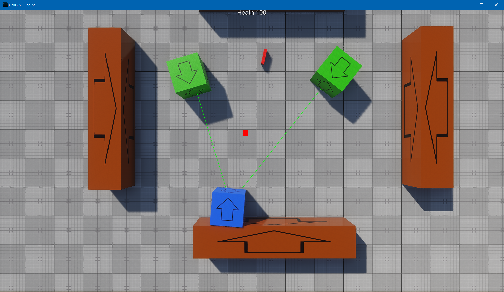

# OpenAir2025-Mosquitto-TopDownShooter
Unigine OpenAir2025 live coding project

https://youtu.be/xF2I2FZ8stg?si=Frn7i81iUg7EKH7s

1. install Unigine SDK BROwser
2. download and activate 2.20.0.0 SDK (SDKs -> ADD SDK -> Unigine 2 Community -> 2.20.0.0 -> install -> make default)
3. add and reconfigurate this project (My Projects -> add existing -> choose .project file -> import project -> repair -> configure)
4. open Editor to generate .runtimes
5. launch with VS2022
